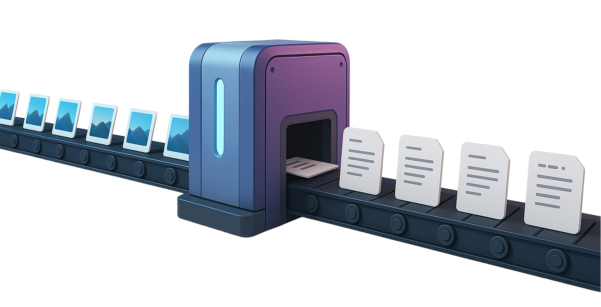

# VisionLLM Batcher

**VisionLLM Batcher** is a local-first AI image batch processing tool designed to work with any large language model (LLM) that supports image inputs. The tool enables automated analysis and information extraction from batches of images using custom prompts. It is fully prompt-agnostic and can handle a variety of image-processing tasks beyond UI specifications.

<p align="center">
  
</p>


We highly recommend using **LM Studio** in combination with the **Qwen2-VL-7B-Instruct** model for an efficient and private local inference setup. This model offers robust image understanding and high-quality text output. LM Studio makes it easy to run the model locally with a simple interface and API access. However, the tool is LLM-agnostic—so you're free to integrate any other LLM API that supports image inputs.

## Features

- Batch processes images using any compatible LLM
- Extracts data from images based on user-defined prompts
- Tracks processing history with batch IDs
- Organized folder structure and auto-sorting
- Clear logging and error handling
- Progress tracking with visual feedback

## Installation

1. Clone the repository:

```bash
git clone https://github.com/mhd-fettah/VisionLLM-Batcher.git
```

2. Navigate to the project directory:

```bash
cd VisionLLM-Batcher
```

3. Create and activate a virtual environment:

```bash
python -m venv venv
venv\Scripts\activate
```

4. Install required packages:

```bash
pip install -r requirements.txt
```

5. Create a `.env` file in the root directory. Replace the API URL below with any LLM endpoint that supports image inputs:

```plaintext
LLM_API_URL=http://localhost:1234/v1/chat/completions
```

## Usage

1. Place your images in the `input_images` folder
2. Add your prompt in `input_images/prompt.txt`
3. Run the application:

```bash
python main.py
```

4. Processed results will be saved in the `output_responses` folder

## Sample Prompts

Customize the prompt to match the kind of data you want to extract from the images. Below are a few useful examples:

### UI to laravel Dev Spec 
```txt
Analyze the attached image of a user interface and generate a minimal product requirement summary with the following structure:

Controller:
    Controller name (e.g., CounselorController)
    List the actions/methods needed (e.g., edit, update, uploadProfilePicture)

Database:
    Main table name
    Fields (column names + types if visible/inferable)
    Note any relationships (e.g., city → country foreign key)

View:
    Blade file name (e.g., counselor/edit.blade.php)
    Key components or sections (e.g., profile image upload, basic info form)

Other Notes:
    Form behavior (e.g., dynamic dropdowns, validation, file upload handling)
    Required/optional field assumptions
    Permissions or role assumptions if relevant

- Format the response in clean bullet points, no extra explanation. Keep it short and developer-friendly.
```

### Extract UI Specifications
```txt
Extract a detailed specification sheet from this UI design image, including component names, hierarchy, dimensions, and color codes.
```

### Extract All Visible Text
```txt
Extract all visible text from this image exactly as shown, maintaining the order and structure.
```

### Describe the Image (General)
```txt
Provide a general description of what is happening in this image, mentioning people, objects, and context.
```

### Describe a UI Design
```txt
Describe the purpose and layout of this UI design. Mention interactive components and potential user actions.
```

### Extract Book Page Text
```txt
Extract and reconstruct the text from this scanned book page. Maintain paragraph structure and line breaks if possible.
```

### Summarize Document Content
```txt
Summarize the content of this document image, focusing on key points, names, and any numerical data.
```

### Object Identification
```txt
Identify and list all objects present in this image, along with how many of each are visible.
```

## Requirements

- Python 3.8+
- An image-capable LLM API (e.g., LM Studio with Qwen2-VL-7B-Instruct)
- Python packages:
  - requests
  - python-dotenv
  - tqdm

## Contributing

Pull requests are welcome. For major changes, please open an issue to discuss what you want to change first.

## License

[MIT](https://choosealicense.com/licenses/mit/)

